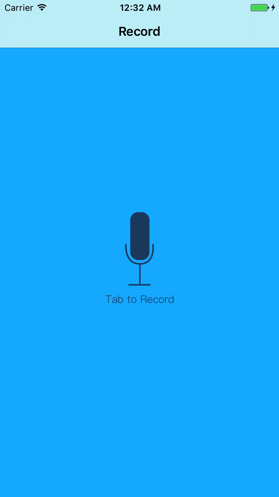
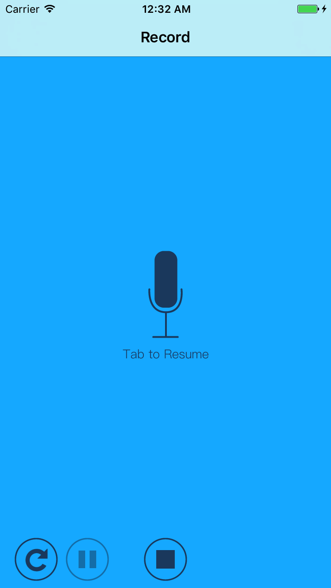
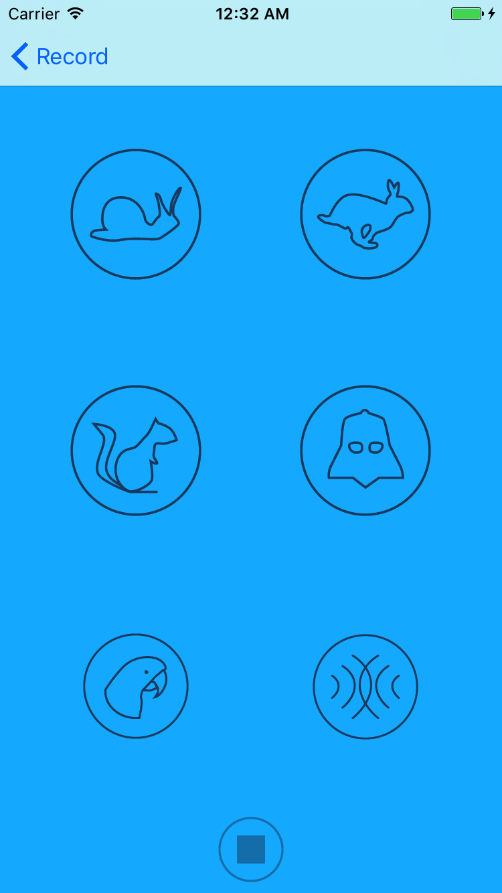

# Pitch Perfect
Give your friend a laugh by recording your sounds and then play them back through a variety of funny filters.

## Overview
The app works for iPhones. It adapts quite well to the variety of the iPhone sizes for both the portrait and landscape modes.

It starts by recording the user's sound, giving the user the ability to pause while recording, 
then it navigates to other screen where there are quite a handful of funny sound filters that 
the user can select from to hear the recorded sound in some funny way.

## Screenshots

Tha app in portrait mode:  
 

Tha app in landscape mode:  
 

## License
See [LICENSE](LICENSE)
